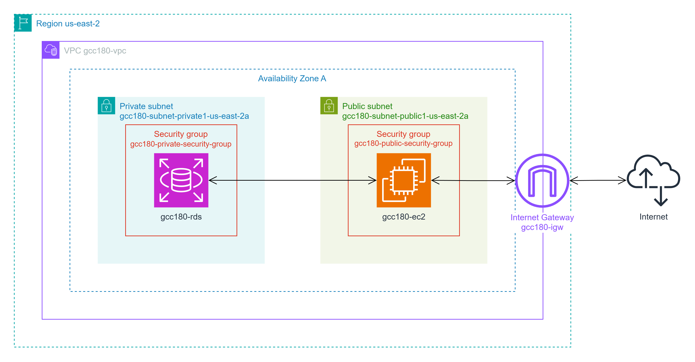

# GCC180

Aplicação simples de cadastro de clientes criada como projeto prático da disciplina Computação em Nuvem (GCC180).

## Instalação

Para realizar a instalação de todas as dependências da aplicação, execute o seguinte comando:

```sh
mvn clean install
```

Para empacotar a aplicação em um arquivo `war` disponibilizado na pasta `target` na raiz do projeto, execute o seguinte comando:

```sh
mvn clean package -P production
```

## Arquitetura

Abaixo, uma representação da arquitetura da aplicação implantada na AWS.

